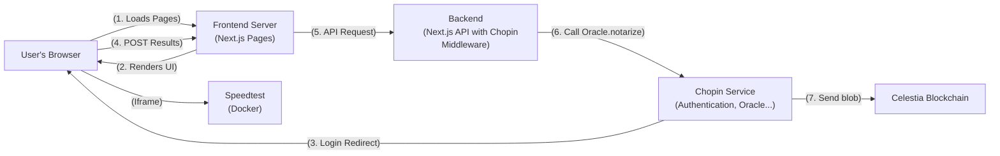

# Chopin Demo: Decentralized Proof-of-Speed

This project is an educational demo designed to teach the fundamentals of building a simple decentralized application (dApp) on Celestia using the Chopin framework.

The application allows users to measure their internet speed, notarize the results using a Chopin Oracle, and record them in a local database. It serves as a hands-on guide to integrating key blockchain concepts into a modern web application built with Next.js.

## How it Works: Core Concepts

This demo illustrates a complete end-to-end flow designed to showcase the essential Chopin framework concepts in the clearest way possible.

### 1. Wallet Authentication (Frontend)
Located in `src/app/speed-test/components/AuthDisplay.tsx`, this component demonstrates the simplicity of Chopin authentication:
```typescript
const { address: chopinAddress, login } = useAddress();
```
Just one line gives you a secure, blockchain-native identity. No email/password forms, no session management complexity.

### 2. Automatic Session Management (Middleware)
The `src/middleware.ts` file shows Chopin's "invisible" power:
```typescript
export { middleware } from "@chopinframework/next";
```
This single line automatically handles wallet sessions across your entire Next.js application.

### 3. Speed Measurement (Iframe)
The user runs a speed test using a self-hosted OpenSpeedTest widget. The widget communicates results back via the `postMessage` API, demonstrating how to integrate external tools into a dApp.

### 4. Data Notarization (Backend)
In `src/app/api/speed-test/route.ts`, two key Chopin functions work together:
```typescript
const address = await getAddress(); // Get authenticated user's wallet address
const notarizedResult = await Oracle.notarize(async () => {
  const timestamp = await Oracle.now();
  return { location, download_speed, upload_speed, ping, timestamp, address, ... };
});
```
The `Oracle.notarize()` function sends data to a trusted execution environment that cryptographically signs it and posts a commitment to the Celestia blockchain, creating tamper-proof evidence.

### 5. Data Storage (Database)
The notarized result is saved to a local SQLite database, but now it's not just data—it's **proof**. Anyone can verify its authenticity using the blockchain record.

## Key Features

### Core Chopin Framework Showcase
- **Simplified Wallet Integration**: The `AuthDisplay.tsx` component demonstrates wallet authentication in just 25 lines of code using the `useAddress` hook.
- **Invisible Middleware**: A single-line middleware configuration enables automatic session management across the entire application.
- **Oracle Notarization**: Clean, focused example of `Oracle.notarize()` creating blockchain-verified proof from everyday data.
- **Server-side Identity**: Seamless access to authenticated wallet addresses in API routes using `getAddress()`.

### Educational Architecture
- **Component Separation**: Each Chopin concept is isolated in its own component for easy demonstration and understanding.
- **Clear Code Organization**: Business logic, UI components, and API routes are cleanly separated for presentation clarity.
- **Minimal Dependencies**: Focus on Chopin framework concepts without unnecessary complexity.

### Supporting Features
- **Self-hosted Speed Test Widget**: Custom Docker container with responsive design and `postMessage` integration.
- **Geolocation with IP Fallback**: Demonstrates real-world data collection for blockchain verification.
- **Robust Error Handling**: Proper error states and user feedback throughout the application flow.
- **Local Development Environment**: Complete local setup that mirrors production behavior for reliable development.

## Production Architecture

This diagram illustrates the architecture of the application in a production environment, showing how the user's browser, our Next.js application, and the Chopin services interact.



### Production Data Flow

1.  **Load Page**: The user's browser requests the application from the **Frontend Server** (e.g., Vercel).
2.  **Render UI**: The server sends back the Next.js application, which renders the UI and the speed test `<iframe>`.
3.  **Login**: The user initiates a login. The browser is redirected to the **Chopin Service** for authentication. After success, Chopin redirects back and sets a secure session cookie in the user's browser.
4.  **Submit Results**: After a test, the frontend sends the results in a `POST` request to our **Backend** (a Next.js API route).
5.  **Middleware Intercepts**: The **Chopin Middleware**, configured in our Next.js app, automatically intercepts this incoming request. It validates the session cookie and injects the user's wallet address into the request headers, making it available to our API logic.
6.  **Notarize**: Our backend API handler calls the `Oracle.notarize()` function. This sends the data to the **Chopin Service's** Oracle.
7.  **Commit to Celestia**: The Oracle processes the data, notarizes it by posting a commitment to the **Celestia Blockchain**, and returns the tamper-proof result to our backend.
8.  **Save to DB**: Our backend saves the notarized result to a production-ready **Cloud Database** (e.g., Vercel Postgres, Neon, etc.).

## Getting Started

Follow these instructions to get the project up and running on your local machine.

### Prerequisites

- [Node.js](https://nodejs.org/en/) (v18 or later)
- [npm](https://www.npmjs.com/)
- [Docker](https://www.docker.com/)

### 1. Clone the Repository

```bash
git clone <repository-url>
cd demo
```

### 2. Install Dependencies

Install the necessary Node.js packages for the Next.js application.

```bash
npm install
```

### 3. Build the Custom Speed Test Image

The OpenSpeedTest widget runs in a custom Docker container with our modifications baked in. Build the image using the provided Dockerfile.

```bash
docker build -f speedtest-server/Dockerfile -t speedtest-server:custom .
```

### 4. Run the Speed Test Container

Run the custom Docker container you just built.

```bash
docker run -d --rm --name speedtest-app -p 8080:3000 speedtest-server:custom
```

- The speed test widget will now be running and accessible to the Next.js application.
- To stop the container, run `docker stop speedtest-app`.

### 5. Run the Next.js Application

Start the main application's development server. The `chopd` command is part of the Chopin framework's tooling and runs a local proxy that simulates the Chopin environment, allowing features like wallet authentication to work correctly.

```bash
npx chopd
```

- The application will be available at `http://localhost:4000`.
- The `chopd` proxy will automatically start your Next.js dev server (running on port 3000) for you.
- Open `http://localhost:4000/speed-test` in your browser to use the application.

## Project Structure for Learning

This project has been organized to clearly highlight the core Chopin framework concepts and make them easy to understand and present. Each component focuses on a specific aspect of decentralized application development.

### Core Chopin Framework Integration

- **`src/middleware.ts`**: The minimal Chopin middleware configuration that enables automatic wallet session management across your entire Next.js application.
- **`src/app/speed-test/components/AuthDisplay.tsx`**: The cleanest example of Chopin wallet authentication using the `useAddress` hook. This 25-line component demonstrates how simple blockchain-native identity can be.
- **`src/app/api/speed-test/route.ts`**: The backend API route showcasing the two key server-side Chopin features:
  - `getAddress()` - Access the authenticated user's wallet address
  - `Oracle.notarize()` - Create tamper-proof, blockchain-verified data

### Component Architecture

- **`src/app/speed-test/page.tsx`**: The main page component, simplified to show the clean integration of authentication and the main application flow.
- **`src/app/speed-test/components/SpeedTestView.tsx`**: The main application logic, demonstrating how to use the `useAddress` hook for conditional rendering and user experience.
- **`src/app/speed-test/components/SpeedTestRunner/`**: Contains the speed test execution logic and results display, separated for clarity.
- **`src/app/speed-test/components/PastResultsSection/`**: Handles querying and displaying historical results, showcasing how to work with notarized data.

### Business Logic and Utilities

- **`src/app/speed-test/lib/`**: Contains focused utility modules:
  - `api.ts` - Client-side API communication
  - `location.ts` - Geolocation handling with IP fallback
  - `iframe.ts` - PostMessage communication with the speed test widget
  - `types.ts` - TypeScript definitions
  - `config.ts` - Application configuration

### Database and Infrastructure

- **`src/lib/database.ts`**: SQLite database operations for local development and data persistence.
- **`public/openspeedtest-custom/`**: Modified OpenSpeedTest widget files with custom styling and postMessage integration.
- **`speedtest-server/Dockerfile`**: Docker configuration for the self-hosted speed test server.

### Key Files for Presentations

When demonstrating this application, focus on these files in order:
1. **`AuthDisplay.tsx`** - Shows how simple wallet authentication is with Chopin
2. **`route.ts` (lines 87-91)** - The `Oracle.notarize()` call that creates blockchain proof
3. **`middleware.ts`** - How Chopin integrates seamlessly with Next.js
4. **`SpeedTestView.tsx`** - Real-world usage of `useAddress` for user experience
