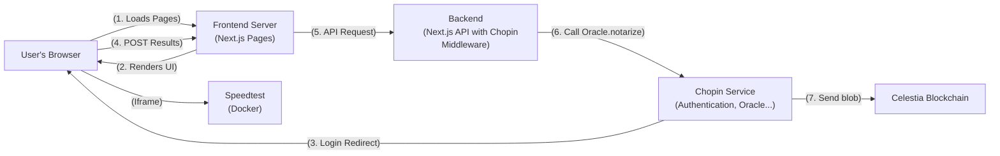

# Chopin Demo: Decentralized Proof-of-Speed

This project is an educational demo designed to teach the fundamentals of building a simple decentralized application (dApp) on Celestia using the Chopin framework.

The application allows users to measure their internet speed, notarize the results using a Chopin Oracle, and record them in a local database. It serves as a hands-on guide to integrating key blockchain concepts into a modern web application built with Next.js.

## How it Works: Core Concepts

This demo illustrates a complete end-to-end flow, from user interaction on the frontend to data notarization and storage on the backend.

1.  **Wallet Authentication (Frontend)**: A user connects their wallet using the `useAddress` hook from `@chopinframework/react` in our Next.js frontend. This provides a secure, blockchain-native identity.

2.  **Speed Measurement (Iframe)**: The user runs a speed test using a self-hosted OpenSpeedTest widget running inside a Docker container. The widget communicates the results back to the Next.js application via the `postMessage` API.

3.  **Data Notarization (Backend)**: The results are sent to a Next.js API route. Here, the backend uses the `Oracle.notarize()` function from `@chopinframework/next`. This powerful feature sends the data to a trusted execution environment (the Chopin Oracle) which cryptographically signs the data and posts a commitment to the Celestia blockchain, returning a trustworthy, tamper-proof result.

4.  **Data Storage (Database)**: The notarized result, along with the user's address and other metadata, is saved to a local SQLite database for easy querying and display. For a production application, this would be replaced by a cloud-based database.

## Key Features

- **Chopin Wallet Integration**: Securely authenticate users and get their wallet address on both the client and server using `@chopinframework/react` and `@chopinframework/next`.
- **Chopin Oracle Notarization**: Make data tamper-proof by notarizing it on the Celestia blockchain.
- **Responsive Speed Test Widget**: A self-hosted OpenSpeedTest widget in a custom Docker container, styled to be fully responsive and embeddable.
- **Robust Iframe Communication**: A clean implementation of the `postMessage` API for seamless communication between the parent app and the iframe.
- **Geolocation with IP Fallback**: Captures the user's location via the browser's Geolocation API, with a reliable fallback to an IP-based lookup service.
- **Duplicate Submission Prevention**: Prevents users from submitting the same result multiple times in rapid succession.

## Production Architecture

This diagram illustrates the architecture of the application in a production environment, showing how the user's browser, our Next.js application, and the Chopin services interact.



### Production Data Flow

1.  **Load Page**: The user's browser requests the application from the **Frontend Server** (e.g., Vercel).
2.  **Render UI**: The server sends back the Next.js application, which renders the UI and the speed test `<iframe>`.
3.  **Login**: The user initiates a login. The browser is redirected to the **Chopin Service** for authentication. After success, Chopin redirects back and sets a secure session cookie in the user's browser.
4.  **Submit Results**: After a test, the frontend sends the results in a `POST` request to our **Backend** (a Next.js API route).
5.  **Middleware Intercepts**: The **Chopin Middleware**, configured in our Next.js app, automatically intercepts this incoming request. It validates the session cookie and injects the user's wallet address into the request headers, making it available to our API logic.
6.  **Notarize**: Our backend API handler calls the `Oracle.notarize()` function. This sends the data to the **Chopin Service's** Oracle.
7.  **Commit to Celestia**: The Oracle processes the data, notarizes it by posting a commitment to the **Celestia Blockchain**, and returns the tamper-proof result to our backend.
8.  **Save to DB**: Our backend saves the notarized result to a production-ready **Cloud Database** (e.g., Vercel Postgres, Neon, etc.).

## Getting Started

Follow these instructions to get the project up and running on your local machine.

### Prerequisites

- [Node.js](https://nodejs.org/en/) (v18 or later)
- [npm](https://www.npmjs.com/)
- [Docker](https://www.docker.com/)

### 1. Clone the Repository

```bash
git clone <repository-url>
cd demo
```

### 2. Install Dependencies

Install the necessary Node.js packages for the Next.js application.

```bash
npm install
```

### 3. Build the Custom Speed Test Image

The OpenSpeedTest widget runs in a custom Docker container with our modifications baked in. Build the image using the provided Dockerfile.

```bash
docker build -f speedtest-server/Dockerfile -t speedtest-server:custom .
```

### 4. Run the Speed Test Container

Run the custom Docker container you just built.

```bash
docker run -d --rm --name speedtest-app -p 8080:3000 speedtest-server:custom
```

- The speed test widget will now be running and accessible to the Next.js application.
- To stop the container, run `docker stop speedtest-app`.

### 5. Run the Next.js Application

Start the main application's development server. The `chopd` command is part of the Chopin framework's tooling and runs a local proxy that simulates the Chopin environment, allowing features like wallet authentication to work correctly.

```bash
npx chopd
```

- The application will be available at `http://localhost:4000`.
- The `chopd` proxy will automatically start your Next.js dev server (running on port 3000) for you.
- Open `http://localhost:4000/speed-test` in your browser to use the application.

## Project Structure for Learning

- `src/app/speed-test/page.tsx`: The main frontend component. This is a great place to see how `@chopinframework/react` is used for authentication (`useAddress`).
- `src/app/api/speed-test/route.ts`: The backend API route. This file demonstrates how to use the `@chopinframework/next` package to get a user's address on the server and notarize data with `Oracle.notarize`.
- `src/app/speed-test/(components|lib)/`: These directories showcase a clean, modular structure for a Next.js application, separating reusable UI components and business logic.
- `public/openspeedtest-custom/`: Contains the modified source files for the OpenSpeedTest widget. We've customized the JavaScript to send `postMessage` events and added custom CSS to make it embeddable.
- `speedtest-server/Dockerfile`: The Dockerfile used to build our custom, self-contained speed test server image.
- `/tmp/speed-tests.db`: A temporary SQLite database file created automatically for local development. This file is not committed to the repository.
